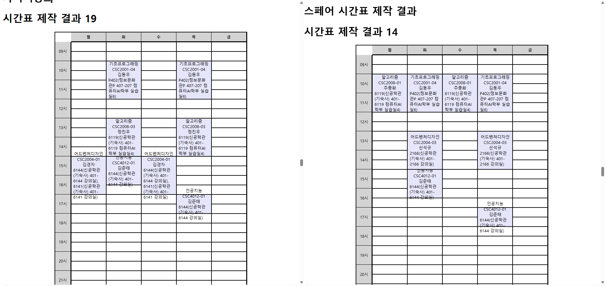

# 프리코스 오픈 미션 - 시간표 제작
> 기존 시간표 제작 프로그램을 발전시켜 보자.
## 프로젝트 개요
본 프로젝트는 우테코 프리코스 오픈미션으로, 기존에 존재하던 시간표 제작 도구를 개선하고 확장하여 다음과 같은 요구사항을 만족하는 프로그램을 개발하는 것을 목표로 합니다.
사용자는 강의를 검색하고 선택한 다음 자동으로 시간표 후보를 생성 및 출력할 수 있어야 하며, 공강 요일 지정, 플랜 B 입력 등 다양한 편의 기능을 포함합니다.

## 제품 기능 목록
<table style="margin-top:0;">
<table>
  <tr>
    <th>순위</th>
    <th>기능</th>
    <th>사용자 스토리</th>
    <th>포인트</th>
    <th>중요도</th>
  </tr>

  <tr>
    <td rowspan="1">1</td>
    <td rowspan="1">마법사 방식 시간표 제작</td>
    <td>사용자는 원하는 강의들을 선택하여 자동으로 시간표를 생성한다.</td>
    <td>8</td>
    <td rowspan="1">상</td>
  </tr>
<tr>
    <td rowspan="2">2</td>
    <td rowspan="2">강의 검색</td>
    <td>시스템은 개설 강의 목록을 출력한다.</td>
    <td>3</td>
    <td rowspan="2">상</td>
  </tr>
  <tr>
    <td>사용자는 원하는 강의들을 학수번호를 이용해 선택한다.</td>
    <td>4</td>
  </tr>
  <tr>
    <td rowspan="1">3</td>
    <td rowspan="1">시간표 출력</td>
    <td>사용자는 생성된 시간표 후보중에서 원하는 시간표를 선택한다.</td>
    <td>4</td>
    <td rowspan="1">상</td>
  </tr>

  <tr>
    <td rowspan="3">4</td>
    <td rowspan="3">개설 강의 엑셀 파일 입력</td>
    <td>사용자는 학교에서 공개된 개설 강의 엑셀 파일을 프로그램에 업로드한다.</td>
    <td>5</td>
    <td rowspan="3">중</td>
  </tr>
  <tr>
    <td>시스템은 엑셀 파일을 파싱하여 강의 정보를 프로그램 내 자료형 형태로 변환한다.</td>
    <td>8</td>
  </tr>
  <tr>
    <td>사용자는 파싱된 데이터로 시간표를 자동 생성할 수 있다.</td>
    <td>6</td>
  </tr>
<tr>
    <td rowspan="3">5</td>
    <td rowspan="3">공강 요일 지정</td>
    <td>사용자는 월~금 중 특정 요일을 공강으로 설정한다.</td>
    <td>3</td>
    <td rowspan="3">중</td>
  </tr>
  <tr>
    <td>시스템은 공강 설정을 만족하는 시간표를 생성한다.</td>
    <td>8</td>
  </tr>
  <tr>
    <td>공강이 불가능한 경우 사용자에게 알림 메시지를 제공한다.</td>
    <td>2</td>
  </tr>
  <tr>
    <td rowspan="1">6</td>
    <td rowspan="1">플랜B 시간표 생성</td>
    <td>사용자는 강의명, 교수명, 학수번호, 강의시간을 직접 입력하여 시간표에 추가한다.</td>
    <td>5</td>
    <td rowspan="1">중</td>
  </tr>
</table>

## 기술 스택
- 언어: Java
- UI/입출력: HTML (Thymeleaf)
- 엑셀 파싱 라이브러리: Apache POI

## 실행 방법
### 1. 로컬에서 실행
1-1. 저장소 클론
> git clone https://github.com/dlsnfl0615/Woowa-Course-Open-Mission.git

1-2. gradle 빌드
>./gradlew build

> ./gradlew run

1-3. 웹 접속
> localhost:8080/RegisterLecture

### 2. 웹 페이지에서 실행
2-1. 웹 페이지 접속
> http://ec2-43-200-174-189.ap-northeast-2.compute.amazonaws.com:8080/RegisterLecture

## 사용 방법
### 기능

1. 원하는 강의명을 검색할 수 있다.
2. 시간표를 만들기 위해 듣고 싶은 강의의 학수번호를 입력한다.
3. 원하는 공강날을 입력하여 그 요일에 강의를 배치하지 않을 수 있다.
4. 경쟁률이 높은 강의를 신청하지 못했을 때를 대비한 스페어 시간표를 제작할 수 있다.
5. 제출 버튼을 눌러서 시간표 제작 결과를 확인한다.

### 시간표 만들기
- 원하는 강의명을 검색한 후 해당 강의의 학수번호를 신청 강의에 입력하시면 됩니다.
- 공강날은 입력하지 않아도 됩니다. 여러 요일을 선택할 수 있습니다.
- 경쟁률이 높아 수강 신청날에 선착순 실패할 것 같은 강의의 학수번호를 스페어 시간표 제작 입력란에 기입하시면 됩니다.

### 제작 결과 확인

시간표 제작 결과와 스페어 시간표 제작 결과를 확인할 수 있습니다.